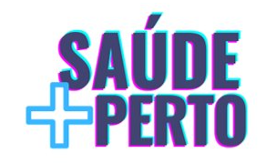
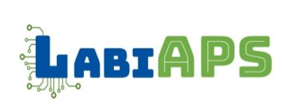

Solarized dark             |  Solarized Ocean
:-------------------------:|:-------------------------:
  

# Saúde + Perto

Uma solução de automação do cadastro individual para equipes de Atenção Primária à Saúde (APS) no Distrito Federal com vistas a apoiar usuários, gestores e profissionais técnicos e da assistência em saúde a obter informações qualificadas para comunicação e identificação de demandas e de priorização da oferta de serviços de saúde

# Laboratório de Inovação
 |